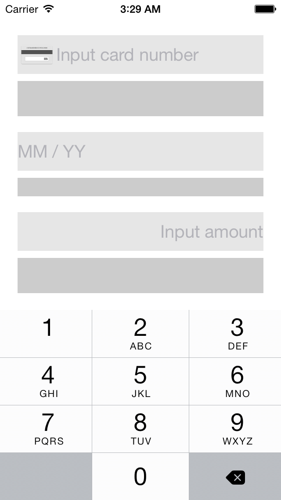
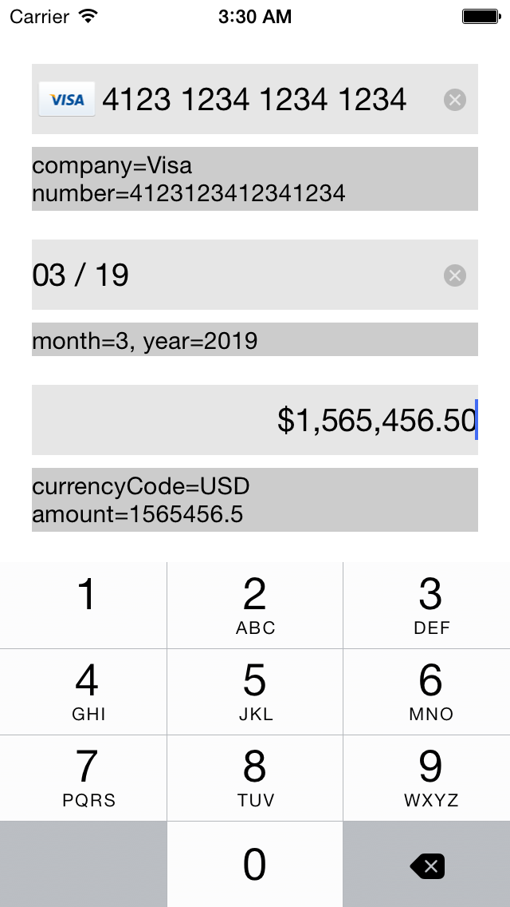

BKMoneyKit
==========

iOS UI controls and formatters for entering money, credit card number and expiry date.

Card logo images by http://www.shopify.com/blog/6335014-32-free-credit-card-icons

## Screenshots




## Classes
| Class | Description |
| ----- | ----------- |
| ```BKCardNumberField``` | Subclass of UITextField that supports formatting card number. You can show card logo image by setting ```showsCardLogo``` to ```YES```. |
| ```BKCardNumberLabel``` | Subclass of UILabel that displays formatted card number and card brand logo. You can mask card number by configuring ```cardNumberFormatter```. |
| ```BKCardNumberFormatter``` | Subclass of NSFormatter. This class has card number pattern information inside and formats according to patterns. You can customize masking behavior, masking character and group separater character. |
| ```BKCardExpiryField``` | Subclass of UITextField that supports formatting card number expiry date. |
| ```BKCurrencyTextField``` | Subclass of UITextField that supports formatting money amount. You can change currency by changing the ```currencyCode``` property of ```numberFormatter```. |


## Examples

### BKCardNumberField

```objc
// create (you can also use interface builder)
BKCardNumberField *cardNumberField = [[BKCardNumberField alloc] initWithFrame:CGRectMake(0, 0, 300, 40)];
cardNumberField.showsCardLogo = YES;
[self.view addSubview:cardNumberField];

// get card number
NSString *cardNumber = cardNumberField.cardNumber;

// get card company name
NSString *companyName = cardNumberField.cardCompanyName;
```

### BKCardNumberLabel
```objc

BKCardNumberLabel *cardNumberLabel = [[BKCardNumberLabel alloc] initWithFrame:CGRectMake(0, 0, 300, 40)];
// set masking character. BLACK CIRCLE (0x25CF)
cardNumberLabel.cardNumberFormatter.maskingCharacter = @"●";
// masking second and third group.
cardNumberLabel.cardNumberFormatter.maskingGroupIndexSet = [NSIndexSet indexSetWithIndexesInRange:NSMakeRange(1, 2)];

```

### BKCardExpiryField

```objc
BKCardExpiryField *field = [[BKCardExpiryField alloc] init];

// get month
NSInteger month = field.dateComponents.month;

// get year
NSInteger year = field.dateComponents.year;
```

### BKCurrencyTextField

```objc
BKCurrencyTextField *field = [[BKCurrencyTextField alloc] init];

// change currency
field.numberFormatter.currencyCode = @"KRW";

// get number value
NSDecimalNumber *number = field.numberValue;
```

### Custom cards images

Just add to your image assets the card logo with the shortName eg. "visa", "amex", "mastercard" etc..
